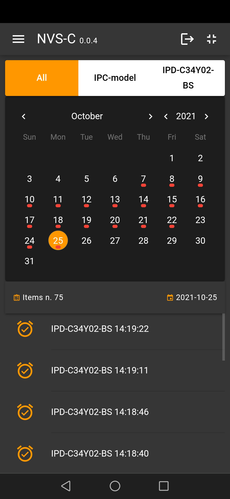

# NVS

Network Video Surveillance

[Screenshots](#screenshots)

# New Features

- Task to monitor HD space for recording (default 20 GB)

- Monitor user logins and more for a security report (logs in root folder)

- Replaced the canvas element for the stream with the video element

- Picture-in-Picture (PiP)

# Features

- Support only onvif protocol

- Support audio/video

- Websocket for stream and commands

- Recording H24

- Motion detection

- PTZ / PRESET

- Server static for host client

- client in out/webclient - source code: https://github.com/DandroidIT/nvs-c (Quasar 2 & Vue3 ts)

# Screenshots

| Login                                                                                                  | Home                                                                                                 | Cam joypad                                                                                                       |
| ------------------------------------------------------------------------------------------------------ | ---------------------------------------------------------------------------------------------------- | ---------------------------------------------------------------------------------------------------------------- |
|  |  |  |

| Cam presets                                                                                                      | Cam settings                                                                                                         | Video Wall                                                                                                          |
| ---------------------------------------------------------------------------------------------------------------- | -------------------------------------------------------------------------------------------------------------------- | ------------------------------------------------------------------------------------------------------------------- |
|  |  | 1 |

| Settings                                                                                                     | Alarms motion detections                                                                                 |
| ------------------------------------------------------------------------------------------------------------ | -------------------------------------------------------------------------------------------------------- |
|  |  |

### Installation

1. Clone the repo

```sh
git clone https://github.com/DandroidIT/NVS.git
```

2. Install NPM packages

```sh
npm install
```

3. Rename file and custom

```sh
`src/config/env_dev_sample.ts` in `src/config/env_dev.ts`
```

4. create ssl certificate

```sh
mkcert https://github.com/FiloSottile/mkcert
```

6. Start

```sh
npm start
```

6. Enjoy

```sh
Open browser https://192.168.1.1:4004/web/
username: admin
password: 123456789
```
